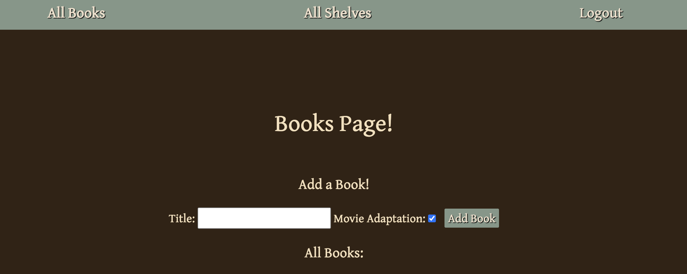

# bookCase

bookCase is an basic application that allows users to interact with other users and their book recommendations. Guests can view a list of books added by users, but users are able to add in a book and mark whether it has a movie adaptation or not. On the book's page, users can see who added the book, have the option of changing if the book has an adaptation, leaving a review for the book, and deleting the book if they added it. 

## Deployed bookCase:
[bookCase](https://bookcase-ilysim.herokuapp.com/books)
## Trello Planning:
[Trello](https://trello.com/b/yZva8URA/bookcase)

## Technologies used:
- HTML
- Node
- Mongoose
- MongoDB
- JavaScript
- github
- CSS
- Bootstrap
- favicon
- OAuth

## Credits:
- Favicon: (https://favicon.io/favicon-generator/)
- Google Fonts: (https://fonts.google.com/specimen/Gentium+Book+Plus?preview.text=bookCase&preview.text_type=custom)
- Bootstrap: (https://getbootstrap.com/)

### Screenshot: 
User View:
Guest View:

## Icebox:
- [ ] Integrate an API.
- [ ] Search for books using the API.
- [ ] Give users the opportunity to add books to their profile.
- [ ] Allow users to comment on each others' favorite books
- [ ] Only delete a review if you are the author of the review.
- [ ] Light/dark mode.
- [ ] Responsive design
